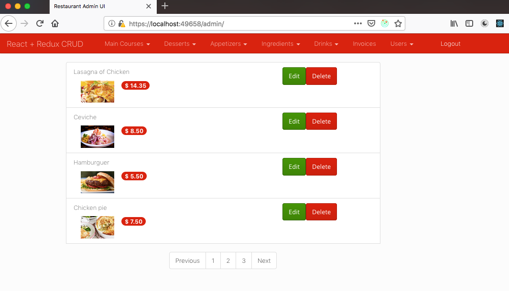
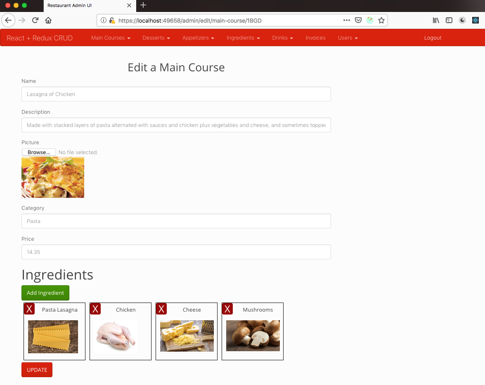
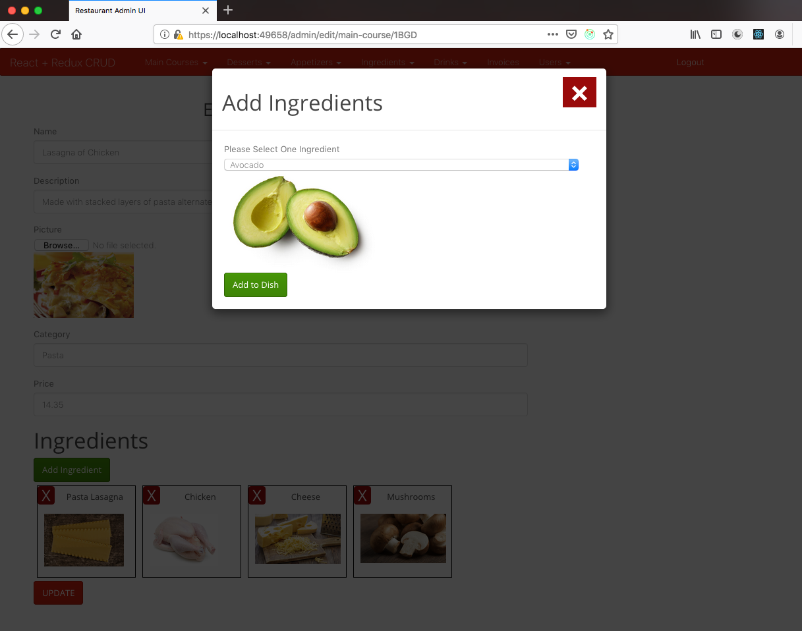
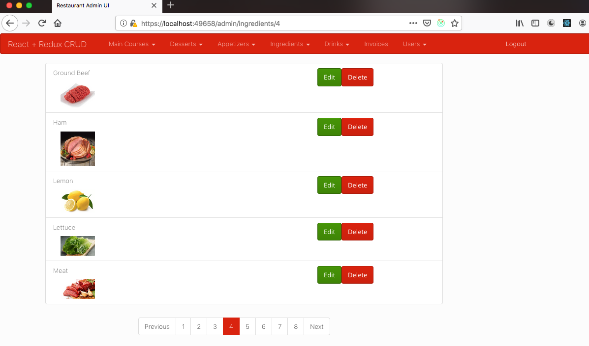
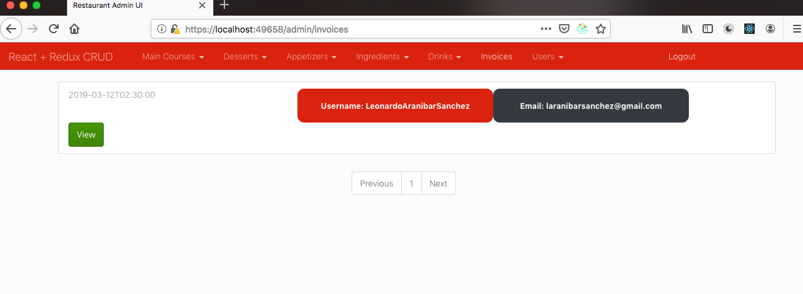
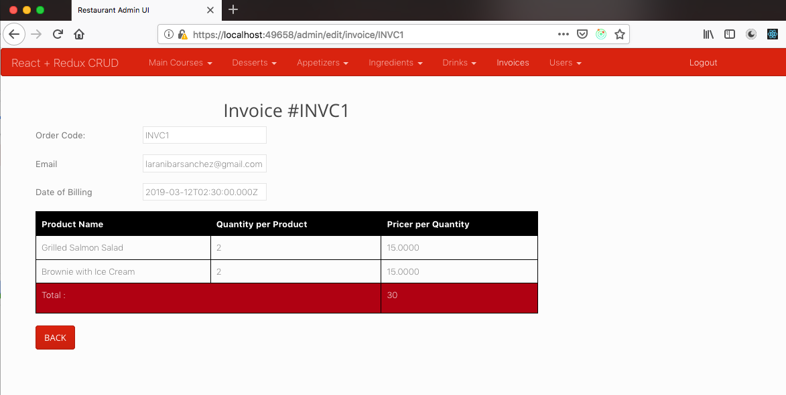

# react-restaurant-admin-crud 

This project require another project as backend [Server Nodejs](https://github.com/LeoCR/server-nodejs-restaurant).

## User Interfaces

### View Main Courses

### Edit Main Course

### Add ingredient to Main Course

### React Router Pagination

### View Invoices

### View Invoice

## Available Scripts

In the project directory, you can run:

### `npm start`

Runs the app in the development mode. 
Open [http://localhost:3000](http://localhost:3000) to view it in the browser.

### `npm run build`

Builds the app for production to the `build` folder. 
It correctly bundles React in production mode and optimizes the build for the best performance.

